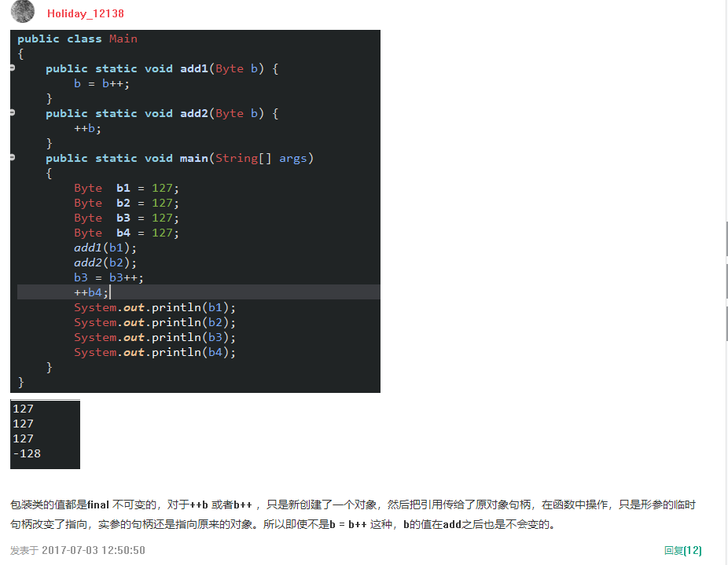

```java
public class StringDemo{
  private static final String MESSAGE="taobao";
  public static void main(String [] args) {
    String a ="tao"+"bao";
    String b="tao";
    String c="bao";
    System.out.println(a==MESSAGE);
    System.out.println((b+c)==MESSAGE);
  }
}  
```


java中如果碰到char、byte和short参与运算时，会自动将这些值转换为int类型然后再进行运算。这里a1和a2就自动转为int类型了，结果也为Int类型。把一个int类型赋值给byte需要转型。


```java
public class ZeroTest {
    public static void main(String[] args) {
     try{
       int i = 100 / 0;
       System.out.print(i);
  }catch(Exception e){
       System.out.print(1);
       throw new RuntimeException();
  }finally{
       System.out.print(2);
  }
      System.out.print(3);
 }
 }
```

12

1、inti = 100/ 0; 会出现异常，会抛出异常，System.out.print(i)不会执行，

2、catch捕捉异常，继续执行System.out.print(1);

3、当执行 thrownewRuntimeException();  又会抛出异常，这时，除了会执行**finally中的代码，其他地方的代码都不会执行**


array和arraylist的区别

1.array能够包含基本类型和对象类型，arraylist只能包含对象类型。array只能存放同种类型的元素，arraylist可以存放其他类型。

2.array数组的空间大小是固定的，arraylist是动态增长的

3.arraylist支持迭代操作


Synchronized和lock锁的区别？

1、lock是一个接口，而synchronized是java的一个关键字。2、synchronized在发生异常时会自动释放占有的锁，因此不会出现死锁；而lock发生异常时，不会主动释放占有的锁，必须手动来释放锁，可能引起死锁的发生。


hashCode()方法和equals()方法的作用其实是一样的，在Java里都是用来对比两个对象是否相等一致。

***那么equals()既然已\******经\******能\******实现\******对\******比的功能了，为什么还要hashCode()呢？\***因为重写的equals()里一般比较的比较全面比较复杂，这样效率就比较低，而利用hashCode()进行对比，则只要生成一个hash值进行比较就可以了，效率很高。*
*

***那么hashCode()既然效率这么高为什么还要equals()呢******？*** 因为hashCode()并不是完全可靠，有时候不同的对象他们生成的hashcode也会一样（生成hash值得公式可能存在的问题），所以hashCode()只能说是大部分时候可靠，并不是绝对可靠，

**所以我们可以得出：**

**1.equals()相等的两个对象他们的hashCode()肯定相等，也就是用equals()对比是绝对可靠的。**

**2.hashCode()相等的两个对象他们的equal()不一定相等，也就是hashCode()不是绝对可靠的。**

所有对于需要大量并且快速的对比的话如果都用equals()去做显然效率太低，所以解决方式是，每当需要对比的时候，首先用hashCode()去对比，如果hashCode()不一样，则表示这两个对象肯定不相等（也就是不必再用equal()去再对比了）,如果hashCode()相同，此时再对比他们的equals()，如果equals()也相同，则表示这两个对象是真的相同了，这样既能大大提高了效率也保证了对比的绝对正确性！


。String str1= "hello", String str2="he"+"llo";之所以str1==str2返回true是因为两者都是在字符串常量池中（由于初始化就会在此区域分布内存）而常量池中的有个与栈区类似的特性，就是当str2指向的常量在常量区已存在时，他不会创建新的内存空间来存此常量，而是指向已有常量的内存（应该是以此节约空间），此时str1与str2这两个引用变量的值都是存"hello"的内存空间地址，但是String str3= "he"+a;String a="llo";时str1==str3返回的为false，是因为：str1指向的hello在编译期一如既往的还是分配在常量区内，a指向的llo也在常量区，虽然str3也是初始化但是编译器无法判断a这货到底是什么个情况，进而不会将str3的等号右侧声明在常量区内，而是在通过构造时在堆区中的非常量池外的内存中声明，至此str3与str1不止是分配内存的时期不同（一个在编译期，一个在运行期）而且在内存空间的区域也不同，上面最高票答案只区分了时间没区分空间。


```java
class A {
    public A() {
        System.out.println("class A");
    }
    { System.out.println("I'm A class"); } 
    static { System.out.println("class A static"); }
}
public class B extends A {
    public B() {
        System.out.println("class B");
    }
    { System.out.println("I'm B class"); }
    static { System.out.println("class B static"); }
    
    public static void main(String[] args) { 
 new B(); 
```

```
class A staticclass B staticI'm A classclass AI'm B classclass B
```

Java程序初始化顺序：

1. 父类的静态代码块
2. 子类的静态代码块
3. 父类的普通代码块
4. 父类的构造方法
5. 子类的普通代码块
6. 子类的构造方法


```java
import java.io.*;
import java.util.*;
public class foo{
public static void main (String[] args){
String s;
System.out.println("s=" + s);
}
}
```

编译错误

局部变量可以先申明不用必须初始化，但使用到了一定要先初始化


声明的二维数组中第一个中括号中必须要有值，它代表的是在该二维数组中有多少个一维数组。


带头大哥不能死，中间兄弟不能断！

一个3列索引(col1,col2,col3),那么MySQL只会会建立三个索引(col1),(col1,col2),(col1,col2,col3)。但是不可以是(col1,col3)这样子断开的


java.util.Collection 是一个集合接口。它提供了对集合对象进行基本操作的通用接口方法。Collection接口在Java 类库中有很多具体的实现。Collection接口的意义是为各种具体的集合提供了最大化的统一操作方式。    java.util.Collections 是一个包装类。它包含有各种有关集合操作的静态多态方法。此类不能实例化，就像一个工具类，服务于Java的Collection框架


String是个不可继承类（final修饰），也是个不可变类（内部char数组被final修饰）。

StringBuffer和StringBuilder内部都是一般的**动态数组**，所以可变。前者是线程安全的，因为方法基本都被synchronized修饰了





```java
public class Test {
 public static void main(String[] args) {
     System.out.println("return value of getValue(): " + getValue());
 }
 public static int getValue() {
     int i = 1;
     try {
         i = 4;
     } finally{
         i++;
         return i;
     }
     }
 }
```

打印 i=5

```java
 public static int getValue() {
        int i = 1;
        try {
            i = 4;
        } finally {
            i=i++;（把戏的重点：这样才是4）
            return i;
        }
    }
```

打印 i=4


如果i单独使用，他会先运算后自增全部实现。如果不是单独使用，进行赋值，那么先进行赋值，然后在自增。可以把他看成有2个i，一个变量i，一个临时变量i。


```java
byte b1=1,b2=2,b3,b6;  
final byte b4=4,b5=6;  
b6=b4+b5;  
b3=(b1+b2);  
System.out.println(b3+b6);
```

答案：语句：b3=b1+b2编译出错

被final修饰的变量是常量，这里的b6=b4+b5可以看成是b6=10；在编译时就已经变为b6=10了

而b1和b2是byte类型，java中进行计算时候将他们提升为int类型，再进行计算，b1+b2计算后已经是int类型，赋值给b3，b3是byte类型，类型不匹配，编译不会通过，需要进行强制转换。

Java中的byte，short，char进行计算时都会提升为int类型