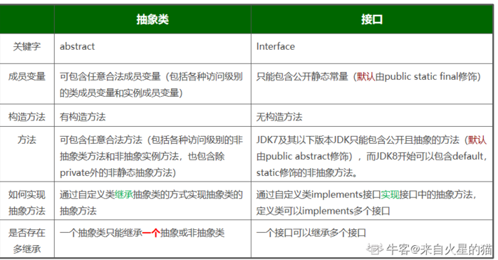
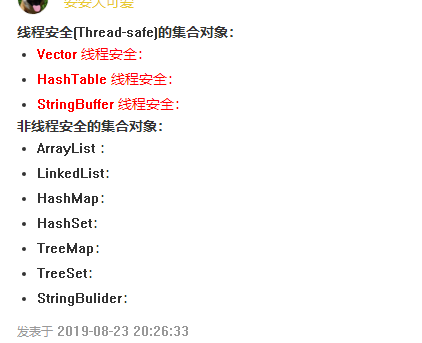
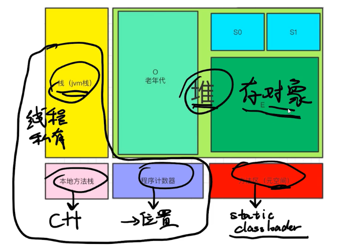
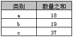

## 1.java跨平台原理

答：java运行时转换为.class字节码文件，然后通过不同平台虚拟机来执行，然后在转化为机器码。像c/c++都是直接转换成机器码。

## 2.java和c各自的优势

答：java是一次编译，到处运行。c是多次编译，多次运行。因为java是一次运行转换为.class文件，而c是每次运行转为机器码。


 jvm  java虚拟机

jre：jvm+lib（类库）

jdk：java开发工具包（jvm+lib+bin等灯）

## 3.&和&&的区别

答：为&时，两边都会运算。当为&&时，当左边为false时，右边就不会参与运算。所以用&&效率更高点。

## 4.访问权限

private   default   protected  public

同一个类   同一个包   子类   所有

## 5.==和equals的区别

对于==，比较的是值是否相等

​      如果作用于**基本数据类型**的变量，则直接比较其存储的 “**值”是否相等**；

　　　　如果作用于**引用类型**的变量，则比较的是所指向的**对象的地址**

　　2）对于equals方法，注意：equals方法**不能**作用于基本数据类型的变量，equals继承Object类，比较的是是否是同一个对象

　　　　如果没有对equals方法进行重写，则比较的是引用类型的变量所指向的**对象的地址**；

　　　　诸如String、Date等类对equals方法进行了重写的话，比较的是所指向的**对象的内容**。

```java
string 是一个bai类，赋值语句后du面的是一个空间地址
String a=new String("1qaz");
String b=new String("1qaz");
System.out.println(a==b); //false
System.out.println(a.equals(b)); //true
new 运算zhi符 是动态执dao行的，两个字zhuan符串在程序运行时被shu分别构造，所以有两个不同的地址，但是有同样的内容
String c="qwer";
String d="qwer";
System.out.println(c==d); //true
System.out.println(c.equals(d)); //true
该方法是静态方法，首先“qwer” 被构造出来， 然后c和d被指向了这个静态字符串，所以地址相等、内容一样
```


## 6.Object的常用方法tostring


```java
public static void main(String[] args) {
        Demo demo=new Demo();
        System.out.println(demo.toString());
        System.out.println(demo);//默认调用
    }
    运行结果：
    com.kude.exercise.Demo@74a14482
	com.kude.exercise.Demo@74a14482
```

## 7.多态的概述

1. **多态的定义**：指允许不同类的对象对同一消息做出响应。即同一消息可以根据发送对象的不同而采用多种不同的行为方式。（发送消息就是函数调用）    不同的类的对象对同一个消息做出的不同反应（重写  继承  父类引用指向子类对象。）这三个都是可以有相同的方法名，然后对这个方法实现自己的方法内容
2. 多态的好处：解耦

## 8.垃圾回收机制

Java语言不需要程序员直接控制内存回收,是由JRE在后台自动回收不再使用的内存,称为垃圾回收机制,简称GC ;

## 9.为什么引入包装类

Java集合中实际存放的只是对象的引用，每个集合元素都是一个引用变量，实际内容都放在堆内存或者方法区里面，但是基本数据类型是在栈内存上分配空间的，栈上的数据随时就会被收回的。

```java
int i = 10; 
Integer in = new Integer(i);//手动将i包装为Integer类型对象 
HashSet set = new HashSet();//定义一个Set集合 
set.add(in);//将包装类对象加入该集合 
System.out.println(set);//打印结果 
同样的效果（自动包装）： 
int i = 10; 
HashSet set = new HashSet(); 
set.add(i);//系统会自动将i装箱为Integer类型的对象然后再存入set集合中 
System.out.println(set);
```

## 10.接口和抽象类的区别

1. 抽象类只能继承一次，但是可以实现多个接口

2. 接口和抽象类必须实现其中所有的方法，抽象类中如果有未实现的抽象方法，那么子类也需要定义为抽象类。抽象类中可以有非抽象的方法

3. 接口中的变量必须用 public static final 修饰，并且需要给出初始值。所以实现类不能重新定义，也不能改变其值。

4. 接口中的方法默认是 public abstract，也只能是这个类型。不能是 static，接口中的方法也不允许子类覆写，抽象类中允许有static 的方法

   

```java
public interface BlogService {

    Blog getBlog(Long id);

    /*markdown转换html*/
    Blog getAndConvert(Long id);
}
```

## 11.new创建对象，对象保存在堆还是栈？

–>堆内存是用来存放由new创建的对象和数组，即动态申请的内存都存放在堆内存

–>栈内存是用来存放在函数中定义的一些基本类型的变量和对象的引用变量

## 12.char的赋值

char a=‘a’; //任意单个字符，加单引号。

char a=‘中’;//任意单个中文字，加单引号。

char a=111;//整数。0~65535。十进制、八进制、十六进制均可。输出字符编码表中对应的字符。

注：只能放单个字符。

```java
	public static void main(String[] args) {
		char c=65;
		System.out.print(c);
	}

======》A
```

## 13.运算符优先级

| 优先级 | 运算符                                           | 结合性   |
| ------ | ------------------------------------------------ | -------- |
| 1      | ()、[]、{}                                       | 从左向右 |
| 2      | !、+、-、~、++、--                               | 从右向左 |
| 3      | *、/、%                                          | 从左向右 |
| 4      | +、-                                             | 从左向右 |
| 5      | «、»、>>>                                        | 从左向右 |
| 6      | <、<=、>、>=、instanceof                         | 从左向右 |
| 7      | ==、!=                                           | 从左向右 |
| 8      | &                                                | 从左向右 |
| 9      | ^                                                | 从左向右 |
| 10     | \|                                               | 从左向右 |
| 11     | &&                                               | 从左向右 |
| 12     | \|\|                                             | 从左向右 |
| 13     | ?:                                               | 从右向左 |
| 14     | =、+=、-=、*=、/=、&=、\|=、^=、~=、«=、»=、>>>= | 从右向左 |

## 14.java多态，如何理解父类引用指向子类对象

要理解多态性，首先要知道什么是“向上转型”。

​    我定义了一个子类Cat，它继承了Animal类，那么后者就是前者是父类。我可以通过  Cat c = new Cat(); 实例化一个Cat的对象，这个不难理解。

​    但当我这样定义时：  Animal a = new Cat();  

表示定义了一个Animal类型的引用，指向新建的Cat类型的对象。由于Cat是继承自它的父类Animal，所以Animal类型的引用是可以指向Cat类型的对象的。

   那么这样做有什么意义呢？因为子类是对父类的一个改进和扩充，所以一般子类在功能上较父类更强大，属性较父类更独特，  定义一个父类类型的引用指向一个子类的对象既可以使用子类强大的功能，又可以抽取父类的共性。 

  所以，父类类型的引用可以调用父类中定义的所有属性和方法，而对于子类中定义而父类中没有的方法，它是无可奈何的；  同时，父类中的一个方法只有在父类中定义而在子类中没有重写的情况下，才可以被父类类型的引用调用；  对于父类中定义的方法，如果子类中重写了该方法，那么父类类型的引用将会调用子类中的这个方法，这就是动态连接。也可以叫做动态绑定。

   动态绑定是指”在执行期间（而非编译期间）“判断所引用对象的实际类型，根据实际的类型调用其相应的方法。

## 15.正则表达式的使用

```java
Pattern p = Pattern.compile("a*b"); 
Matcher m = p.matcher("aaaaab");
boolean b = m.matches();
```

## 16 自动装箱 自动拆箱

```java
    public void Test7(){
        //自动装箱：
        Integer num = 12;
        //自动拆箱：
        System.out.println(num + 12);//24
　　　　　//基本数据类型的对象缓存：
        // -128~127 输出true
        // 超过该范围，输出false
        Integer num1 = 12;（在自动装箱中进行判断是否在-128 127），在的话，直接看有没有12，有12引用相同
        Integer num2 = 12;
        System.out.println(num1 == num2);//true

        Integer num3 = 129;
        Integer num4 = 129;
        System.out.println(num3 == num4);//false
    }
```


## 17 array（数组）和arraylist（集合）的区别

Array：它是数组，申明数组的时候就要初始化并确定长度，长度不可变，而且它只能存储同一类型的数据，比如申明为String类型的数组，那么它只能存储S听类型数据 
ArrayList：它是一个集合，需要先申明，然后再添加数据，长度是根据内容的多少而改变的，ArrayList可以存放不同类型的数据，在存储基本类型数据的时候要使用基本数据类型的包装类

**Array可以包含基本类型和对象类型，ArrayList只能包含对象类型**。

```java
public class Array {
    public static void main(String[] args) {
        baiint[] arr1=new int[]{1,2,3,4};
        ArrayList arr2=new ArrayList();
        arr2.add(11);
        arr2.add("Test");
        arr2.add(false);
    }
}
```

## 17.set集合的实现方式

当向HashSet集合中存入一个元素时，HashSet会调用该对象的hashCode方法来得到该对象的hashCode值，然后根据该hashCode值决定该对象在HashSet中的存储位置。如果有两个元素通过equals方法比较true，但它们的hashCode方法返回的值不相等，HashSet将会把它们存储在不同位置，依然可以添加成功。
也就是说。HashSet集合判断两个元素的标准是两个对象通过equals方法比较相等，并且两个对象的hashCode方法返回值也相等。

靠元素重写hashCode方法和equals方法来判断两个元素是否相等，如果相等则覆盖原来的元素，依此来确保元素的唯一性

## 18.集合的图





Properties实现了Map接口，是线程安全的      Statck栈也是线程安全的


## 19.迭代器

因为容器的内部结构不同，很多时候可能不知道该怎样去遍历一个容器中的元素。所以为了使对容器内元素的操作更为简单，Java引入了迭代器模式！ 

　　把访问逻辑从不同类型的集合类中抽取出来，从而避免向外部暴露集合的内部结构。

在Java中Iterator为一个接口，它只提供了迭代的基本规则。在JDK中它是这样定义的：对Collection进行迭代的迭代器。

```java
package java.util;
public interface Iterator<E> {
    boolean hasNext();//判断是否存在下一个对象元素

    E next();//获取下一个元素

    void remove();//移除元素
}

```

　　Java中还提供了一个Iterable接口，Iterable接口实现后的功能是‘返回’一个迭代器，我们常用的**实现了该接口的子接口有:Collection<E>、List<E>、Set<E>等**。该接口的iterator()方法返回一个标准的Iterator实现。实现Iterable接口允许对象成为Foreach语句的目标。就可以通过foreach语句来遍历你的底层序列。

```java
import java.util.Iterator;
public interface Iterable<T> {
    Iterator<T> iterator();
}

```

```java
public static void main(String[] args) {
 2         List<String> list = new ArrayList<String>();
 3         list.add("张三1");
 4         list.add("张三2");
 5         list.add("张三3");
 6         list.add("张三4");

19         //使用迭代器遍历ArrayList集合
20         Iterator<String> listIt = list.iterator();
21         while(listIt.hasNext()){
22             System.out.println(listIt.next());
23         }
24         //使用迭代器遍历Set集合
25         Iterator<String> setIt = set.iterator();
26         while(setIt.hasNext()){
27             System.out.println(listIt.next());
28         }
29         //使用迭代器遍历LinkedList集合
30         Iterator<String> linkIt = linkList.iterator();
31         while(linkIt.hasNext()){
32             System.out.println(listIt.next());
33         }
34 }

```

## 19-1异常体系


Throwable是所有异常的超类，他有两个重要的子类，一个是Error(错误)，一个是Exception（异常）。


Error：他是表示程序无法处理的错误，一般都是jvm出现了问题。通常有虚拟机运行错误、类定义错误等等。这种错误时无法去处理的。


Exception：异常又分为两类，一类是运行时异常，一类是编译异常。

运行时异常：空指针异常、下标越界等等

编译异常：

## 19-2日志级别

8个级别优先级从高到低依次为：OFF、FATAL、ERROR、WARN、INFO、DEBUG、TRACE、 ALL。
建议只使用四个级别，优先级 从高到低分别是 ERROR、WARN、INFO、DEBUG。


## 20.线程

### 1.状态以及转变


阻塞状态分为三种:ˈsɪŋkrənaɪzd

1、等待阻塞:运行的线程执行wait（）方法，JVM会把该线程放入等待池中。

2、同步阻塞:运行的线程在获取对象同步锁时，若该同步锁被别的线程占用，则JVM会把线程放入锁池中。

3、其他阻塞:运行的线程执行Sleep（）方法，或者发出I/O请求时，JVM会把线程设为阻塞状态。当Sleep（）状态超时、或者I/O处理完毕时，线程重新转入就绪状态。

### 2.什么是线程池

线程池顾名思义就是事先创建若干个可执行的线程放入一个池（容器）中，需要的时候从池中获取线程不用自行创建，使用完毕不需要销毁线程而是放回池中，从而减少创建和销毁线程对象的开销。

### 3.同步和异步

同步，就是调用某个东西时，调用方要等待这个调用返回结果才能继续往后执行。

异步，和同步相反 调用方不会理解得到结果，而是在调用发出后调用者可用继续执行后续操作，被调用者通过状体来通知调用者，或者通过回掉函数来处理这个调用

### 4.进程同步和线程调度的常用方法

线程同步就是当一个线程对内存进行操作时，其他线程不可以对这个内存地址进行操作，其他线程只能是等待状态。

线程调度是按照特定的机制为多个线程分配cpu使用权；

wait()使一个线程处于等待状态，并且释放所持对象的锁；

sleep()使一个正在运行的线程处于睡眠状态，是一个静态方法，调用此方***抛出InterruptException异常

notify()唤醒一个处于等待状态的线程，调用此方法不能确定唤醒哪一个线程 又jvm确定并且与优先级无关

notifyall()唤醒所有进行等待状态的线程，该方法不是将对象的锁给所有线程 而是让他们竞争，获得锁的线程进入就绪状态。

### 5.sleep和yield

线程睡眠(sleep)

让当前正在执行的线程暂停一段时间，并进入阻塞状态，则可以通过调用Thread类的静态sleep()方法来实现。当前线程调用sleep()方法进入**阻塞状态**后，在其睡眠时间内，该线程不会获得执行的机会，而其它任何优先级的线程都可以得到执行的机会，即使系统中没有其它可执行的线程，处于sleep()的线程也不会执行，sleep()是用来暂停线程的执行。

线程让步（yield）

yield()方法是一个和sleep()方法有点相似的方法，它也是Thread类提供的一个静态方法。可以让当前正在执行的线程暂停，但它不会阻塞该线程，只是将该线程转入**就绪状态**。yeild()只是让当前线程暂停一下，让系统的线程调度器重新调度一次，完全可能的情况是：当某个线程调用了yield()线程暂停之后，线程调度器又将其调度出来重新执行。
当某个线程调用了yield()方法暂停之后，只有优先级与当前线程相同，或者优先级比当前线程更高的处于就绪状态的线程才会获得执行机会。

总结：

①sleep()方法给其他线程运行机会时不考虑线程的优先级，因此会给低优先级的线程以运行的机会；yield()方法只会给相同优先级或更高优先级的线程以运行的机会；

② 线程执行sleep()方法后转入阻塞（blocked）状态，而执行yield()方法后转入就绪（ready）状态；
③ sleep()方法声明抛出InterruptedException，而yield()方法没有声明任何异常；
④ sleep()方法比yield()方法（跟操作系统CPU调度相关）具有更好的可移植性

### 6.stop()和suspend（）不支持的原因

stop：同步代码块执行到一半，遇到stop来了，锁没了，代码还没有执行完。而且其他线程还能操控你的代码，线程不安全。

suspend：线程挂起，资源不释放，容易死锁

### 7.实现同步的5种方法

#### 1.同步方法1 synchronized关键字修饰方法

```java
    //存钱
    public  synchronized void addMoney(int money){
        count +=money;
        System.out.println(System.currentTimeMillis()+"存进："+money);
    }

```

#### 2.同步方法2 同步代码块

```java
    //存钱
    public  void addMoney(int money){
        synchronized (this) {
            count +=money;
        }
        System.out.println(System.currentTimeMillis()+"存进："+money);
    }

```

#### 3.(volatile)实现线程同步

每次要线程要访问volatile修饰的变量时都是从内存中读取，而不是存缓存当中读取，因此每个线程访问到的变量值都是一样的。这样就保证了同步。


#### 4.同步方法 使用重入锁实现线程同步

 在JavaSE5.0中新增了一个java.util.concurrent包来支持同步。ReentrantLock类是可重入、互斥、实现了Lock接口的锁， 它与使用synchronized方法和快具有相同的基本行为和语义，并且扩展了其能力。
   ReenreantLock类的常用方法有：
     ReentrantLock() : 创建一个ReentrantLock实例 
     lock() : 获得锁 
     unlock() : 释放锁 

```java
  // 存钱
    public void addMoney(int money) {
        lock.lock();//上锁
        try{
            count += money;
            System.out.println(System.currentTimeMillis() + "存进：" + money);

        }finally{
            lock.unlock();//解锁
        }
    }

```

#### 5. 同步的方法 使用局部变量实现线程同步


### 8.线程池

#### 1.什么是线程池

他是多线程的处理方式，将任务提交到线程池中，并且任务的执行交给线程池来处理。线程池的应用可以大大减少线程的创建和销毁，让工作线程能够循环使用。

组成：线程池管理器，工作线程，任务接口，任务队列

#### 2.常见的线程池（5种）

1.newSingleThreadExecute:创建单一的线程池，他只有一个工作线程，所有的任务都按指定的顺序依次执行。

2.newFixedThreadPool:创建一个定长的线程池，超出这个数量，就需要在任务队列中等待。

3.newCachedThreadPool：可缓存的线程池，当线程过多，就会自动回收。

4.newScheduleThreadPool：大小不限制，定时和周期的执行线程

5.newWorkStealingPool：拥有多个任务队列的线程池

#### 3.线程池的7个参数

1.corePoolSize线程池最小核心数量大小，最低限度的线程数量，他们不会被销毁

2.maxmumPoolSize线程池最大线程数量

3.keepAliveTime空闲线程存活时间

4.unit空闲线程存活时间的单位

5.workQueue工作队列

6.threadFactory线程工厂

7.handler拒绝策略

### 9.synchronized和volatile的区别

首先先讲解一下应用场景，然后开始具体讲区别

1.volatile是用来修饰变量的，synchronized可以修饰变量和方法

2.volatile只能保证变量的可见性，synchronized可以保证可见性和原子性

3.volatile不会造成阻塞，synchronized可能造成阻塞

### 10、synchronized和lock区别

　　1）Lock是一个接口，而synchronized是Java中的关键字，synchronized是内置的语言实现；

　　2）synchronized在发生异常时，会自动释放线程占有的锁，因此不会导致死锁现象发生；而Lock在发生异常时，如果没有主动通过unLock()去释放锁，则很可能造成死锁现象，因此使用Lock时需要在finally块中释放锁；

　　3）Lock可以让等待锁的线程响应中断，而synchronized却不行，使用synchronized时，等待的线程会一直等待下去，不能够响应中断；

　　4）通过Lock可以知道有没有成功获取锁，而synchronized却无法办到。

　　5）Lock可以提高多个线程进行读操作的效率。

## 21.java术语

- JVM

Java虚拟机，它是整个Java实现跨平台的最核心的部分，所有的java程序会首先被编译为.class的类文件，这种类文件可以在虚拟机上执行，也就是说class并不直接与机器的操作系统相对应，而是经过虚拟机间接与操作系统交互，由虚拟机将程序解释给本地系统执行。

- JRE

是指java运行环境。光有JVM还不能成class的执行，因为在解释class的时候JVM需要调用解释所需要的类库lib。在JDK的安装目录里你可以找到jre目录，里面有两个文件夹bin和lib,在这里可以认为bin里的就是jvm，lib中则是jvm工作所需要的类库，而jvm和 lib和起来就称为jre。

- JDK

指的是Java的工具包。
JDK包含JRE，而JRE包含JVM。

## 22.java反射机制

概念：java反射机制是在**运行状态**中，对于任意一个类， 都能够知道这个类的所有属性和方法;对于任意一个对象，都能够动态调用它的任意-一个方法和属性;这种动态获取的信息以及动态调用对象的方法的功能称为java语言的反射制。-------在运行的时候，任何一个类能够知道所有的属性和方法（注意这是动态的，不运行的时候我们想知道方法和属性，必须看底层才知道）   对于class a这个类，它能够调用他的任意一个方法和属性

主要借助那些类


Class     Field    Method    Constructor   Array

反射机制的运行过程

要想解剖一个类，必须先要获取到该类的**字节码文件**对象。而解剖使用的就是Class类中的方法。所以先要获取到每一个字节码文件对应的**Class类型的对象**。


类名.class     对象.getClass      Class.forName


反射机制在哪里使用？

当你无法确定传入的类是怎么样子的，要通用 兼容来规定所传入的类，动态获取方法和属性


- 在运行时判断任意一个对象所属的类。
- 在运行时判断任意一个类所具有的成员变量和方法。
- 在运行时任意调用一个对象的方法
- 在运行时构造任意一个类的对象


## 23.JVM

### 1.JVM加载原理

类的装载通过ClassLoader和他的子类来实现。他们负责在运行时查找和装入类。类加载器本身也是一个类，负责将硬盘里的class读取到内存中。因为他是隐式装载，所以不需要我们去关心类的加载。

   隐式装载，程序在运行过程中当碰到通过new 等方式生成对象时，隐式调用类装载器加载对应的类到jvm中，
  显式装载，通过class.forname()等方法，显式加载需要的类 ,隐式加载与显式加载的区别：两者本质是一样的。

### 2.JVM内存模型

JVM 内存模型是什么？
（1）JVM 内存模型共分为5个区：Java虚拟机栈、本地方法栈、堆、程序计数器、方法区（元空间）
（2）各个区各自的作用：
	a.本地方法栈：用于管理本地方法的调用，里面并没有我们写的代码逻辑，其由native修饰，由 C 语言实现。
	b.程序计数器：它是一块很小的内存空间，主要用来记录各个线程执行的字节码的地址，例如，分支、循环、线程恢复等都依赖于计数器。
	c.方法区（Java8叫元空间）：用于存放已被虚拟机加载的类信息，常量，静态变量等数据。
	d.Java 虚拟机栈：用于存储局部变量表、操作数栈、动态链接、方法出口等信息。（栈里面存的是地址，实际指向的是堆里面的对象）
	e.堆：Java 虚拟机中内存最大的一块，是被所有线程共享的，几乎所有的对象实例都在这里分配内存；
（3）线程私有、公有
	a.线程私有：每个线程在开辟、运行的过程中会单独创建这样的一份内存，有多少个线程可能有多少个内存
		Java虚拟机栈、本地方法栈、程序计数器是线程私有的
	b.线程全局共享的
		堆和方法区
（4）栈虽然方法运行完毕了之后被清空了，但是堆上面的还没有被清空，所以引出了GC（垃圾回收），不能立马删除，因为不知道是否还有其它的也是引用了当前的地址来访问的




当形参为基本数据时，对该变量的修改，也只是修改栈中的数据，当方法运行结束后，数据就直接销毁了，调用的还是没有改变过的实参。而当引用类型时，在栈中会存储该变量的地址，指向该变量的实参，引用类型的修改，实参也会变化，但是当方法运行结束后，只会销毁栈中的地址。

### 3.JVM的作用

解释运行字节码程序以及消除平台相关性

1.将字节码解释成具体平台上的机器指令执行

2.将消除具体平台的相关性，因为java可以在不同的虚拟机上运行，所以你对平台具体相关的信息你并不需要知道，只需要生成相关的指令就行


## 24.GC垃圾回收机制

```java
总结：垃圾回收
（1）判断的标准：
	GC Root:
		a.被Java虚拟机栈直接或者间接引用的对象
		b.被本地方法栈直接或者间接引用的对象
		c.方法区的变量或者常量直接引用的对象
（2）处理的算法：
	a.标记-清理算法：在对象后面标记一下，把不含有标记的对象给它删除掉。缺点：会产生内存碎片，例如分别删除了2个1k的内存（现在有2个1k的内存是空着了），这时new了1个2k的内存出来，这个时候不能把这个2k的内存放在2个1k的内存里面，而且也不能被拆分，所以这2个1k的内存就不能被合理的利用起来了。
	b.标记-整理算法：如果下一个内存是空的，就把空的内存往前面顶，这样就会减少内存的碎片。缺点：代价比较大，因为所有的内存都要往前面移动
	c.复制算法：将内存一分为二（假设是a内存，b内存），在a内存中标记要删除的内存，然后在b内存中，将a内存中没有标记的内存一个个移过来，紧凑的拍着，避免了内存碎片和代价大的问题。缺点：要有2倍的内存
	d.实际的GC算法：
		Ⅰ、将内存进行了划分，一部分是年轻代（Young区），还有一部分是老年代（Old区）
		Ⅱ、年轻代也进行了划分，分别是1个Eden区和2个Survivor区;Old区就是整个的一块
		Ⅲ、new的对象产生在Eden区，当Eden区快满的时候，就会触发GC，这个GC是在Young区的，所以也叫Young GC,Young GC采用的是复制算法，把在Eden区需要删除的打上一个标记，不需要删除的放在Survivor区（S0或者S1均可，内存大小 S0:S0:E区=1：1：8）。为什么要2块Survivor区？因为这个S区是交替工作的，在E区打完标记后，不需要删除的被放到S0区，然后把E区+S1区一起删除，等下一次满的时候，将不需要删除的被放到S1区，然后把E区+S0区一起删除...如此往复的工作，比将内存一分为二的效率要高一些的（主要是针对 对象的朝生夕死的特点去设计的）
		Ⅳ、Old区：在每一次的Young GC的时候，它的年龄都会加1，直到年龄到达了15岁（7是初始值，岁数是个动态变化的值，在每次gc的时候都会重新计算，和s区存活率[默认50%]等其它参数有关），它就不在Survivor区里面进行复制了，而是直接将不需要删除的对象放到Old区里面，因为之前的Young GC都没去掉，说明可能要过很久才能去掉；除了存了年龄大于等于15岁的，还存了大的对象（如：1个1千万大小的int数组），Old区满的时候也会触发GC，Old GC一般也会伴随着Young GC,所以也叫做Full GC,Full GC会引起Stop-The-World,整个Java程序直接暂停，来全力的进行垃圾回收，
		Ⅴ、垃圾回收主要使用的是标记-清理算法或者是标记-整理算法
		Ⅵ、标记-清理算法，标记-整理算法 主要是在Old区里面的；复制算法主要用在Young区
	e.比较著名的垃圾收集器：
		Ⅰ、年轻代的 ParNew（复制算法） ; 老年代的 CMS （标记-清理算法）
		Ⅱ、最新的采用了G1垃圾收集器

```

me：首先将内存划分为2个部分，一部分是Yonug区，一部分是old区。yong区又进行划分，划分为一个E区，2个S区。new出来的对象首先在E区，然后E区要满了，就会触发YongGC，这时采用的算法是复制算法，将要保存的对象复制到S区，两个S区一直循环使用。在每一次YoungGC触发的时候，年龄会+1，当加到15的时候，直接将要保存的对象放到old区。当old区也要满的时候，因为触发GC，因为这时yongGC也会触发，所以叫fullGC，这时触发的算法是标记清理  和 标记整理算法。


### 24-1垃圾回收器

- **新生代回收器**：Serial、ParNew、Parallel Scavenge（1.8）
- **老年代回收器**：Serial Old、Parallel Old（1.8）、CMS
- **整堆回收器**：G1

serial：单线程，复制算法

parnew：多线程，复制算法

parallel scavenge：多线程，复制


serial old：单线程，标记-整理

cms:是基于serial old，经历

初始标记：标记GC root直接关联的对象

并发标记：对堆进行标记

重新标记：标记由于运行期间导致标记变动的标记

并发清除：清除垃圾对象


### 24-2GC Root的对象

1.虚拟机栈中引用的对象

2.本地方法栈中引用的对象

3.方法区中常量引用的对象

4.方法中静态属性引用的对象

24-3引用的分类

强引用：只要引用存在，垃圾回收器永远不会回收

软引用：非必须引用，内存溢出、内存不足就回收

弱引用：被弱引用关联的对象，在垃圾回收就会回收

虚引用：任何时候都可以被回收

| 引用类型 | 被回收时间    | 用途           | 生存时间      |
| -------- | ------------- | -------------- | ------------- |
| 强引用   | 从来不会      | 对象的一般状态 | JVM停止运行时 |
| 软引用   | 内存不足时    | 对象缓存       | 内存不足时    |
| 弱引用   | jvm垃圾回收时 | 对象缓存       | gc运行后      |
| 虚引用   | 未知          | 未知           | 未知          |

## 24 io

BIO:同步阻塞（傻傻等着开水烧开）

NIO：同步非阻塞（可以干自己的事，不时有时来看看水烧开了没）

AIO：异步非阻塞（烧开之后自己会叫你，期间你干自己的事情）

## 25.servlet

### 1.servlet的作用

接收请求数据、处理请求、完成响应

### 2.servlet实现的三种方式

#### 1.实现Servlet接口

```java
package com.tsinghua;
import javax.servlet.*;
import java.io.*;
public class Hello implements Servlet{
	@Override
	public void destroy() {
	}	 
	@Override
	public ServletConfig getServletConfig() {
		// TODO Auto-generated method stub
		return null;
	}	 
	@Override
	public String getServletInfo() {
		// TODO Auto-generated method stub
		return "";
	}
	@Override
	public void init(ServletConfig arg0) throws ServletException {
		// TODO Auto-generated method stub
		System.out.println("init it");
	}
	@Override
	public void service(ServletRequest req, ServletResponse res)
			throws ServletException, IOException {
		pw.println("hello,world");	

	}
}

```

#### 2.继承GenericServlet

```java
package com.tsinghua;
//这是我的第二个servlet,通过继承GenericServlet来开发

import javax.servlet.GenericServlet;
import javax.servlet.ServletException;
import javax.servlet.ServletRequest;
import javax.servlet.*;
import java.io.*;
public class HelloGen extends GenericServlet{

	/**
	 * 重写service方法即可。
	 */
	@Override
	public void service(ServletRequest req, ServletResponse res)
			throws ServletException, IOException {
		// TODO Auto-generated method stub
		//返回HelloWorld!generic
		PrintWriter pw=res.getWriter();
		pw.println("HelloWorld!generic");	
	}	
}

```

#### 3.继承HttpServlet。

```java
package com.tsinghua;
//这是我的第3个servlet,通过继承HttpServlet来开发

import javax.servlet.http.HttpServlet;
import javax.servlet.http.HttpServletRequest;
import javax.servlet.http.HttpServletResponse;

import java.io.*;

public class HelloHttp  extends HttpServlet{

public void doGet(HttpServletRequest req, HttpServletResponse resp)
{
	//业务逻辑在这里写。
	try {
		PrintWriter pw=resp.getWriter();
		pw.println("Hello,Http");
	} catch (IOException e) {
		// TODO Auto-generated catch block
		e.printStackTrace();
	}
	
}
public void doPost(HttpServletRequest req, HttpServletResponse resp)
{
	//post和get请求一样
	this.doGet(req, resp);
}
}

```

### 3.servlet的生命周期

Servlet 生命周期可被定义为从创建直到毁灭的整个过程。以下是 Servlet 遵循的过程：

- Servlet 初始化后调用 **init ()** 方法。
- Servlet 调用 **service()** 方法来处理客户端的请求。
- Servlet 销毁前调用 **destroy()** 方法。
- 最后，Servlet 是由 JVM 的垃圾回收器进行垃圾回收的。


### 4.session和cookie的区别


### 5.JSP内置作用域


### 6.过滤器和拦截器的区别


这种有web中才能用过滤器


### 7.jsp嵌入脚本方式

<% java代码 %>            

<%!声明java方法%>

<%=java变量%>

```jsp
<%!
    public String test(){
      return "HelloWorld";
    }
%>
<%Stringstr=test();%>
<%=str%>
```

### 8.jsp内置对象9个

1、request：表示一次请求，HttpServletRequest。

2、response：表示一次响应，HttpServletResponse。

3、pageContext：⻚面上下文，获取⻚面信息，PageContext。

4、session：表示一次会话，保存用户信息，HttpSession。

5、application：表示当前 Web 应用，全局对象，保存所有用户共享信息，ServletContext。

6、config：当前 JSP 对应的 Servlet 的 ServletConfig 对象，获取当前 Servlet 的信息。

7、out：向浏览器输出数据，JspWriter。

8、page：当前 JSP 对应的 Servlet 对象，Servlet。

9、exception：表示 JSP ⻚面发生的异常，Exception。

## 26.数据库

### 1.inner join内连接

概述：

inner join(等值连接)：只返回两个表中联结字段相等的行。

left join(左联接)：返回包括左表中的所有记录和右表中联结字段相等的记录。

right join(右联接)：返回包括右表中的所有记录和左表中联结字段相等的记录。

例子：

表A记录如下：                                                           
aID　　　　　aNum
1　　　　　a20050111
2　　　　　a20050112
3　　　　　a20050113
4　　　　　a20050114
5　　　　　a20050115

---------------------------------------

表B记录如下:
bID　　　　　bName
1　　　　　2006032401
2　　　　　2006032402
3　　　　　2006032403
4　　　　　2006032404
8　　　　　2006032408

------------------------

1.left join

sql语句如下: select * from A **left join** B **on** A.aID = B.bID

结果如下:
aID　　　　　aNum　　　　　bID　　　　　bName
1　　　　　a20050111　　　　1　　　　　2006032401
2　　　　　a20050112　　　　2　　　　　2006032402
3　　　　　a20050113　　　　3　　　　　2006032403
4　　　　　a20050114　　　　4　　　　　2006032404
5　　　　　a20050115　　　　NULL　　　　　NULL

--------------------

2.right join
sql语句如下: 

```sql
select * from A right join B on A.aID = B.bID

```

结果如下:
aID　　　　　aNum　　　　　bID　　　　　bName
1　　　　　a20050111　　　　1　　　　　2006032401
2　　　　　a20050112　　　　2　　　　　2006032402
3　　　　　a20050113　　　　3　　　　　2006032403
4　　　　　a20050114　　　　4　　　　　2006032404
NULL　　　　　NULL　　　　　8　　　　　2006032408

### 2.group by

概述：就是将一张表根据分组的条件将数据表拆分成很多小区域，可以把这些小区域都看成一条数据，然后对这些数据进行操作。


```sql
select 类别, sum(数量) as 数量之和 from A  group by 类别

```




### 3.order by

```sql
select 类别, sum(数量) AS 数量之和
from A
group by 类别
order by sum(数量) desc              （默认从小到大esc）

```


### 4.聚合函数

函数作用支持性sum(列名)求和　　　

​                      　max(列名)最大值　　　　

​                           min(列名)最小值　　　　

​                          avg(列名)平均值　　　　

​                          first(列名)第一条记录仅Access支持

​                           last(列名)最后一条记录仅Access支持

​                           count(列名)统计记录数注意和count(*)的区别

平均值

```
select 类别, avg(数量) AS 平均值 from A group by 类别;

```

求各组记录数目

```
select 类别, count(*) AS 记录数 from A group by 类别;

```

### 5.Having

```sql
select 类别, sum(数量) as 数量之和 from A
group by 类别
having sum(数量) > 18   （要与聚合函数联合使用）

```

### 6.LIKE


```sql
-- "Persons" 表中选取居住在以 "N" 开始的城市里的人 
   SELECT * FROM Persons WHERE City LIKE 'N%';
-- 从 "Persons" 表中选取居住在不包含 "lon" 的城市里的人 
   SELECT * FROM Persons WHERE City NOT LIKE '%lon%';
-- "Persons" 表中选取名字的第一个字符之后是 "eorge" 的人 
   SELECT * FROM Persons WHERE FirstName LIKE '_eorge';
--"Persons" 表中选取居住的城市以 "A" 或 "L" 或 "N" 开头的人 
   SELECT * FROM Persons WHERE City LIKE '[ALN]%'; 
--"Persons" 表中选取居住的城市不以 "A" 或 "L" 或 "N" 开头的人 
   SELECT * FROM Persons WHERE City LIKE '[!ALN]%';

```

### 7.索引

概念：对数据库表中一列或多列的值进行排序的一种结构，使用索引可快速访问数据库表中的特定信息。

底层原理：当数据库数据较大的时候，当查询的时候采用索引可以节省很多的时间。mysql索引的底层实现索引的数据结构是B树或者B+树。也就是当建立索引的时候，系统就会建立一个索引文件存储在磁盘中，


错误

MyISAM引擎是采用b+树作为索引结构，b+树的特点就是所有的数据都是存储在叶子节点上，并且节点通过链表连接，查询数据顺序查找就行。InnoDB引擎也是采用b树作为索引结构的，他是叶子节点和非叶子节点都有存储数据，方向从左往右上，数据由小变大，查找的方式是二分查找。


#### 7-1索引的分类

普通索引：就是一个最基本的索引，没有任何的限制	

唯一索引：要求所有的值都是唯一的，允许有空值

主键索引：特殊的唯一索引，不允许有空值

全文索引：全文索引（FULLTEXT）仅可以适用于MyISAM引擎的数据表；作用于CHAR、VARCHAR、TEXT数据类型的列。

组合索引：为了更多的提高mysql效率可建立组合索引，遵循”最左前缀“原则。

​		


概念：（B+树数据只存在叶子节点）

聚簇索引：索引项的顺序和表中记录的物理顺序是一致的，即叶子节点就是数据节点。

非聚簇索引：叶子节点是索引文件，包含着指向对应数据块的地址


聚簇索引和主键的关系：一个表中的聚簇索引只能有一个，通常默认是主键，如果你设置了主键，那么默认就是加上了聚簇索引。如果你不想要让主键作为索引，就要在主键声明之前先设置好一个唯一的剧组索引，在添加主键。如果都不声明，会有一个隐藏的列。


#### 7-2Hash索引与B+树索引的区别

由于Hash索引结构和B+ 树不同，因此在索引使用上也会有差别：

（1）Hash索引不能进行范围查询，而B+树可以。
这是因为Hash索引指向的数据是无序的，而B+ 树的叶子节点是个有序的链表。

（2）Hash索引不支持联合索引的最左侧原则（即联合索引的部分索引无法使用），而B+树可以。
对于联合索引来说，Hash索引在计算Hash值的时候是将索引键合并后再一起计算Hash值，所以不会针对每个索引单独计算Hash值。因此如果用到联合索引的一个或多个索引时，联合索引无法被利用。

（3）Hash索引不支持Order BY排序，而B+树支持。
因为Hash索引指向的数据是无序的，因此无法起到排序优化的作用，而B+树索引数据是有序的，可以起到对该字段Order By 排序优化的作用。

（4）Hash索引无法进行模糊查询。而B+ 树使用 LIKE 进行模糊查询的时候，LIKE后面前模糊查询（比如%开头）的话可以起到优化的作用。

（5）Hash索引在等值查询上比B+树效率更高。
不过也存在一种情况，就是索引列的重复值如果很多，效率就会降低。这是因为遇到Hash冲突时，需要遍历桶中的行指针来进行比较，找到查询的关键字非常耗时。所以Hash索引通常不会用到重复值多的列上，比如列为性别，年龄等。

### 8.SQL调优

1. 在经常需要进行检索的字段上创建索引
2. 一个表的索引数最好不要超过6个，索引固然可以提高相应的 select 的效率，但同时也降低了 insert 及 update 的效率，因为 insert 或 update 时有可能会重建索引
3. 尽量将多条SQL语句压缩到一句SQL中，避免过多的执行SQL语句
4. 任何地方都不要使用 select * from t ，用具体的字段列表代替“*”，不要返回用不到的任何字段
5. 尽可能的使用 varchar/nvarchar 代替 char/nchar，变长字段存储空间小，可以节省存储空间，搜索效率更高
6. 除聚合函数用到HAVING外，其他地方尽量用where字句替换HAVING字句
7. 尽量避免在 where 子句中对字段进行 null 值判断，否则将导致引擎放弃使用索引而进行全表扫描
8. in 和 not in 也要慎用，否则会导致全表扫描
9. 使用事务，保证数据的完整性。要避免这种情况，就应该使用事务，它的作用是：要么语句块中每条语句都操作成功，要么都失败。换句话说，就是可以保持数据库中数据的一致性和完整性。事物以BEGIN关键字开始，COMMIT关键字结束。在这之间的一条SQL操作失败，那么，ROLLBACK命令就可以把数据库恢复到BEGIN开始之前的状态。

8-1索引的优化

1.避免对列的操作，因为如果对列进行运算，会导致全表的扫描

2.避免不必要的类型转换，因为字符型数据和整形数据进行比较时，会自动转换

3.增加查询的范围限制

4.尽量的不要新建索引，尽量的扩展索引，（a）  （a，b）

5.对于like查询  %不要放前面，这样会全表查找


### 9.子查询

```sql
SELECT * FROM article WHERE uid = (SELECT uid FROM user WHERE status=1 ORDER BY uid DESC LIMIT 1)
SELECT * FROM t1 WHERE column1 = (SELECT MAX(column2) FROM t2)
SELECT * FROM article AS t WHERE 2 = (SELECT COUNT(*) FROM article WHERE article.uid = t.uid)

```

10.数据连接池的工作机制

背景：使用原始的JDBC创建连接和关闭连接非常耗时。而且每个数据库都有数据库连接的上限，如果使用单一的数据库连接，这样使用执行效率太低。如果建立过多的数据库连接，这7样也会降低数据库的效率，因为数据库对每一个数据库连接都会创建一个事务管理锁。

工作机制：当数据库连接池启动的时候，会自动默认创建一定数量的数据库连接，并且他会一直维持不少于最低数据的数据库连接。当进行数据库操作时，会从数据池中取出一个数据连接，使用结束时，就会将这个连接放回数据池中。数据池给应用程序返回的也是一个Connection接口的对象，但是进行了新的实现，所以当应用程序获取到数据连接时，数据库连接就会把他的连接标识 为忙，当调用colse方法时，并不会把这个数据库连接关闭，而是连接标识为空闲，这样这个连接又可以给其他应用程序使用

### 10.数据库主从复制

https://blog.csdn.net/weixin_43879074/article/details/88525006

什么是主从复制？

一台服务器充当主数据库服务器，然后建立一个与主数据库服务器相同的环境。主服务器会将更新信息写到一个二进制的日志中，然后将这份的日志记录发送到从服务器去更新执行。

主从复制的好处？

1.可以作为后备数据库，当主数据库故障后，切换到从服务器上工作

2.业务量过大时，只靠主数据库服务器会降低访问效率。从服务器可以分担工作

3.读写分离，数据库能支持更大的并发。

主从复制的原理？

1.主数据库服务器中的bin-log二进制文件记录了所有的sql语句

2.然后将从服务器将bin-log中的sql语句全都复制过来

3.最后让从服务器中的relay-log全部把sql语句执行一遍

三个线程：

bin-log输出进程：当从服务器连接主服务器的时候，将bin-log里面的内容输出到从服务器。

从库I/O线程：将bin-log中的内容发送的relay log文件上

从库SQL线程：更新执行relay log文件


### 11.数据库的ACID

原子性（Atomicity）是指事务是一个不可分割的工作单位，事务中的操作要么都发生，要么都不发生。

一致性（Consistency）指事务前后数据的完整性必须保持一致。

隔离性（Isolation）指多个用户并发访问数据库时，一个用户的事务不能被其他用户的事务所干扰，多个并发事务之间数据要相互隔离。

持久性（Durability)是指一个事务一旦提交，它对数据库中数据的改变就是永久性的，即便数据库发生故障也不应该对其有任何影响。

### 12.三范式

> https://www.cnblogs.com/xiaozengzeng/p/10720226.html

1NF:字段不可分;

2NF:(在第一范式的基础上)有主键，非主键字段依赖主键;

3NF:（在第二范式的基础上）非主键字段不能相互依赖;

### 13.索引失效的情况

1.查询条件有or

2.对于多列索引，不是使用第一部分

3.like查询是以%开头

4.索引是字符串，查询条件的时候字段要用引号

### 14.什么时候用Innodb什么时候用MyISAM。

InnoDB主要面向OLTP(OnLine Transaction Processing ，联机事务处理)的应用。MyISAM主要面向一些OLAP(OnLine Analysis Processing，联机分析处理)的应用。


## MyISAM

data存的是数据地址。索引是索引，数据是数据。索引放在XX.MYI文件中，数据放在XX.MYD文件中，所以也叫非聚集索引。


## InnoDB引擎

data存的是数据本身。索引也是数据。数据和索引存在一个XX.IDB文件中，所以也叫聚集索引。


### 15.jdbc提交事务过程

1.使用connection提供的方法调用setAutoCommit(false)，设置手动提交事务

2.用commit（）提交事务

3.如果发生错误，使用rollback返回事务

### 16.jdbc操作数据库时，如何提高读取数据的性能以及更新数据的能力

使用ResultSet的对象调用setFetchSize()指定每次抓取的记录数

```java
Statement stmt = conn.createStatement();
ResultSet rsset = stmt.executeQuery("SELECT * FROM user LIMIT 30");
rsset.setFetchSize(10);
while(rsset.next()){
 //这里还是30条记录，setFetchSize()没有起作用啊。
}

```

使用PreparedStatement类的addBatch()把所有需要执行的sql语句添加到批处理中，然后用executeBatch方法来执行当前批重点的语句

```java
Connection conn=null;

   PreparedStatement ps=null;

   ResultSet rs =null;

   String sql ="INSERT INTO user VALUES(?,?,?)";

   @Test

   public void test() throws SQLException{

   try {

      conn= JDBCUtil.getConnection();

      ps = conn.prepareStatement(sql);

      for (int i = 0; i < 10000; i++) { 

             ps.setInt(1, i+1);

             ps.setString(2, "name"+i);

             ps.setString(3, "password"+i);

             ps.addBatch();
       }
       long start = System.currentTimeMillis();

       ps.executeBatch();

```

### 17.statement和PrepareStatemnt的区别

PrepareStatemnt能够进行预编译，相比效率更高

PrepareStatement能够防治sql注入，因为他的底层能把 ‘  转换为/

### 18.sql执行顺序

from  on  join  where   group by   cube/roiiup  having   select  distinct   order by    limit

### 19.jdbc的反射及其连接

1.通过反射机制Class.forName去加载驱动，会将驱动类的实例注册到DriverManager中

2.通过DriverManager的getConnection获取去进行数据库的连接，成功返回一个Connection对象

3.获得执行sql语句对象Statement

4.通过execute去执行sql语句。

5.关闭jdbc对象


### 20、JDBC中execute、executeQuery和executeUpdate的区别

executeQuery：他返回的是一个resultset结果集，一般用来执行select，而且他的速度是最快的。

executeupdate：他返回的是一个整数，表示受影响的行数。一般用INSERT   UPDATE     DELETE

execute:可以查询任何的语句，一般来执行比较复杂的sql语句。

alt+enter补全


## 27.spring

### 1.自动装配（autowire）

   指的是bean标签里面的属性和pojo中的数据进行自动装配，这样bean里面的属性绑定就不用写了

```xml
<!--  构造方法注入   实际上是按构造函数的参数类型自动装配  -->
<bean id="student" class="auto_constructor.student">
        <property name="name" value="猫儿"></property>
</bean>
<bean id="school" class="auto_constructor.school" autowire="constructor"></bean>

```

\- no：不进行自动装配，手动设置Bean的依赖关系。
\- byName：根据Bean的名字进行自动装配。
\- byType：根据Bean的类型进行自动装配。
\- constructor：类似于byType，不过是应用于构造器的参数，如果正好有一个Bean与构造器的参数类型相同则可以自动装配，否则会导致错误。
\- autodetect：如果有默认的构造器，则通过constructor的方式进行自动装配，否则使用byType的方式进行自动装配。

### 2.依赖注入

指的是，在bean标签中，属性是如何和pojo中的字段进行绑定，更涉及他的本质，这个bean里面是要写完整的

1、Set注入 2、构造器注入 3、接口注入

```xml
<bean id="userDao" 
    class="cn.tedu.spring.UserDao">
    <property 
              name="username" value="root">
    </property>
</bean>

```

```xml
<bean id="person" class="com.lzj.spring.Person">
<constructor-arg value="lzj" index="0"</constructor-arg>
<constructor-arg value="20" index="1"></constructor-arg>
<constructor-arg value="female" index="2"></constructor-arg>
</bean>

```

### 3.bean管理注解

Component    Service    Controller     Repository

注册到ico容器中，创建bean实例

### 4.属性注入

@Autowired根据byType进行自动装配

当有多个类型相同时，可以用@Qualifier（value=“id”）一起使用

@Resoruce默认是按照byName进行，name和type指定了话，都可以使用

@Value：注入普通类型属性@Value(value=“abc”)

### 5.ioc概念

对象由Spring来创建，管理、装配

### 6.ioc是如何实现的 

1.首先从applicationContext中获取bean的定义信息注册到bean定义注册表

2.通过第一次调用getBean操作，会实例化一个bean

3.将实例化的bean放到bean缓存池中

4.之后使用就可以获取bean了

### 7.spring中bean的生命周期

https://www.cnblogs.com/shoshana-kong/p/10692887.html

1.bean的实例化

2.按照bean的定义信息配置bean的属性


（1）通过构造器创建 bean 实例（无参数构造）
（2）为 bean 的属性设置值和对其他 bean 引用（调用 set 方法）
（3）调用 bean 的初始化的方法（需要进行配置初始化的方法）
（4）bean 可以使用了（对象获取到了）
（5）当容器关闭时候，调用 bean 的销毁的方法（需要进行配置销毁的方法）

### 8.AOP的概念

是一种“横切”的技术，面向切面编程。他把响应多个类的公共行为封装成一个模块，这就是切面，然后供业务模块共同调用。

### 9.AOP中的概念

连接点（Joinpoint）：类里面的那些方法可以被增强

切点（Pointcut）：真正被增强的那个方法 

execution([权限修饰符] [返回类型] [类全路径] [方法名称]([参数列表]) )

增强（Advice）：是要连接到目标类上的那个方法（一段程序）

引介（Introduction）、织入（Weaving）、

切面（Aspect）：由切点和增强组成，包括对横切功能和连接点的定义。


（1）连接点（Join point）：**指程序运行过程中所执行的方法，可被增强的方法**。在Spring AOP中，一个连接点总代表一个方法的执行。 

（2）切面（Aspect）：被**抽取出来的公共模块**，可以用来会横切多个对象。Aspect切面可以看成 Pointcut切点 和 Advice通知 的结合，一个切面可以由多个切点和通知组成。

在Spring AOP中，切面可以在类上使用 @AspectJ 注解来实现。

（3）切点（Pointcut）：切点用于定义 要对**哪些Join point连接点**进行拦截。

切点分为execution方式和annotation方式。execution方式可以用路径表达式指定对哪些方法拦截，比如指定拦截add*、search*。annotation方式可以指定被哪些注解修饰的代码进行拦截。

（4）通知（Advice）：指要在连接点（Join Point）上**执行的动作**，即增强的逻辑，比如权限校验和、日志记录等。通知有各种类型，包括Around、Before、After、After returning、After throwing。

（5）目标对象（Target）：**包含连接点的对象，也称作被通知（Advice）的对象**。 由于Spring AOP是通过动态代理实现的，所以这个对象永远是一个代理对象。

（6）织入（Weaving）：通过动态代理，在目标对象（Target）的方法（即连接点Join point）中**执行增强逻辑（Advice）的过程。**

（7）引入（Introduction）：添加额外的方法或者字段到被通知的类。Spring允许引入新的接口（以及对应的实现）到任何被代理的对象。例如，你可以使用一个引入来使bean实现 IsModified 接口，以便简化缓存机制。


### 10.spring为企业级开发带来的好处

1.非侵入式：用户不需要为原有的代码引入框架的信息。

2.IOC容器：对象的创建、管理都不需要用户去管理，降低了耦合。并且对象之间的依赖发生改变，只需要更改xml配置文件

3.AOP：把影响多个类的公共行为封装成一个一个模块，降低了业务逻辑之间的耦合

4.事务管理：能够接纳多种持久层技术，并提供了声明式事务。

### 11.spring框架的优点

1.非侵入式框架

2.能够直接使用pojo开发，从而使运行环境隔离

3.推动了设计风格向面向编程和面向接口转变，提高代码的重用性

4.可以选择多种不同的技术实现

### 12.BeanFactory和ApplicationContext有什么区别？

1.ApplicationContext是Beanfactory的子类，相比于父类，有了更多的功能，比如国际化的支持、资源文件的访问、载入多个配置文件

2.beanfactory是通过延迟加载bean的，只有在访问这个bean的时候，才会对这个bean进行实例化，如果有的bean有问题，我们就不能提前发现错误；而applicationcotext是在容器启动后，一次性创建了所有的bean，如果bean有错误就可以提前发现错误。

3.applicationcontext载入的bean是单实例，他会一次性载入所有的bean，速度快，但是占用内容。而beanfactory速度慢，节约内存。

### 12.事务的传播行为

@Transactional(propagation=Propagation.REQUIRED)

required:有事务就运行，没事务就自己创建一个

required_new:我就要自己创建一个事务

supports:有事务就在事务中运行，没事务就以非事务的方式运行

not_supports:不能再事务中运行，有事务也要把事务挂起

mandatory:必须在事务中运行，没有就抛出异常

never:不能再事务中运行，有事务就抛出异常

nested:在事务的嵌套事务中运行

### 13.事务的隔离级别

读的问题：

脏读：一个未提交事务读取另一个未提交事务的数据。（未提交的事务会回滚，修改过的数字被读取会回滚到未修改的数字，可另一个读取的数字是修改过的数字，这样就错了）

不可重复读：一个未提交的事务读取到另一个提交事务修改数据（a和b同时开启事务获取同一条数据，数据的值为1000，a把1000修改成了500并成功提交了事务，这边的b并未提交事务，但是又查了一遍这条数据，数据的值也变成了500导致两次查询结果不一致。）也就是两次读取的数值不一致


幻读（虚读）：幻读和不可重复读类似，就是一个未提交的事务读取到另一个事务刚刚添加的数据。


### 14.AOP的注解操作

1.导入依赖  jar包

2.代理类用@Aspect生成代理对象

3.在spring配置文件中开启Aspect代理对象

< aop :aspectj- - autoproxy></ aop :aspectj-autoproxy>

4.execution([权限修饰符] [返回类型] [类全路径] [方法名称]([参数列表]) )


## 28.mybatis

半自动化；sql和代码的分离；

mybatis-config.xml

​       数据源的配置-----连接数据库


工具类


读取配置文件     加载流     获取sqlsessionfactory对象


```java
//sqlSessionFactory --> sqlSession
public class MybatisUtils {
private static SqlSessionFactory sqlSessionFactory;

static{
    try {
        //使用Mybatis第一步：获取sqlSessionFactory对象
        String resource = "mybatis-config.xml";
        InputStream inputStream = Resources.getResourceAsStream(resource);
        sqlSessionFactory = new SqlSessionFactoryBuilder().build(inputStream);
    } catch (IOException e) {
        e.printStackTrace();
    }

}

//既然有了 SqlSessionFactory，顾名思义，我们就可以从中获得 SqlSession 的实例了。
// SqlSession 完全包含了面向数据库执行 SQL 命令所需的所有方法。
public static SqlSession  getSqlSession(){
    return sqlSessionFactory.openSession();
}
}

```

sqlsession包含了面向数据库执行sql命令所需的所有方法


让我们探究sql是如何执行的


resultType：返回的结果集，一般是接口中泛型，要写全类名

namespace:接口绑定的全类名


接口为什么能实例？

```sql
举一个简单的例子：java.lang.List是一个接口，但是List list=new ArrayList();是没有任何错误的，因为ArrayList实现了List接口。

这样来回答吧，为什么父类的引用能指向子类对象呢？

父类定义了子类中一定存在的方法和属性。

同理，接口的引用指向他的实例化对象也是因为实例化对象中必然要实现接口中定义的方法和属性。

对象的类型还是new出来的类型，或方法返回的类型，

（如DriverManager.getConnection(String a,String b,String c)静态方法返回Connection接口的实例化对象）。

也可以这样写：

Connection conn =new XXX ()

XXX为实现Connection接口的类。

只不过引用（变量名）如conn只能调用接口定义的方法（这也是接口的意义之一）

```


@Test
public void test(){
    //第一步：获得SqlSession对象
    SqlSession sqlSession = MybatisUtils.getSqlSession();


    //方式一：getMapper
    UserDao userDao = sqlSession.getMapper(UserDao.class);//参数为UserDao.class是与usermapper的namespace进行了绑定，mapper是xml    有点类似动态代理，获取的是接口，却能调用方法
    List<User> userList = userDao.getUserList();
    
    for (User user : userList) {
        System.out.println(user);
    }
    
    //关闭SqlSession
    sqlSession.close();


}


方式二老了


不要忘记注册


还有一个问题

约定大于配置：一些默认配置不用去改


思路搭建：

1.导入依赖：mysql和mybatis的依赖

2.需要一个sqlsession对象，所以需要建造一个工具类，SqlSessionFactoryBuilder===>SqlSessionFactory====>SqlSession

3.核心配置文件配置数据库，并且需要注册mapper

4.编写pojo，然后mapper.xml（namespace绑定接口）和对应的接口


增删改需要提交事务


set中开启自动驼峰命名规则   数据库：last_name      代码：lastNam


数据源有2种：

- 普通数据源   即数据库驱动自带的数据源
- 连接池   包括数据库驱动自带的连接池，以及DBCP、C3P0等常用的第三方连接池。

jdbc是java的数据驱动程序，java语言必须通过jdbc来访问数据库。JDBC是java封装的对数据库的操作


普通数据源采用直连数据库的方式，调用 getConnection() 获取连接时，实际上底层仍是调用 DriverManager.getConnection(url, user, password); 来获取连接；关闭连接时，就是实实在在地关闭连接，释放资源。

连接池是在服务器上创建一个连接池，预先建立一些数据库连接，放在连接池中，调用 getConnection() 获取连接时，只是从连接池中取出一个连接，调用close()关闭连接时，并不是真的关闭连接，是由连接池回收连接，下次还可以接着用。创建数据库连接是很花时间的，使用连接池减少了时间开销。


连接池：
连接池是由容器（比如Tomcat）提供的，用来管理池中的连接对象。
连接池自动分配连接对象并对闲置的连接进行回收。
连接池中的连接对象是由数据源（DataSource）创建的。
连接池（Connection Pool）用来管理连接（Connection）对象。

总结：连接池是用来对数据源产生的连接对象的管理

数据源：
数据源（DataSource）用来连接数据库，创建连接（Connection）对象。
 java.sql.DataSource接口负责建立与数据库的连接

总结：创建连接对象的


JDBC是java封装的对数据库的操作


### 1.什么是mybatis

是半ORM框架，开发者只需要关注sql语句的编写；可以使用xml和注解配置和映射pojo与数据库中的记录，省去了jdbc代码和手动获取参数以及获取结果集；


通过xml或者注解的方式，将sql语句对应的statement进行配置，通过java中的对象与sql的动态参数进行映射，生成最终的sql语句，最后由mybatis框架进行执行  并将结果映射成java对象并返回。

### 2.为什么说mybatis是半自动orm映射工具

因为在查询关联对象或关联集合时，需要我们手动去编写sql去完成那个结构，而全自动orm映射工具可以根据对象关系模型直接获取。

### 3.mybatis的优缺点

优点：

1.sql语句写在xml中，方便管理，而且解除了sql与程序代码的耦合，不会破坏现在的代码设计。而且提供xml标签，支持动态sql。

2.相比于jdbc，减少了大量的代码，而且不需要手动开关连接。

3.可以和各种数据库兼容

4.可以和spring集成

5.支持映射

缺点：

1.sql语句的编写工作量大，特别是字段多、关联表多时

2.依赖数据库，不能随意更改数据库

### 4.#{}和${}的区别

${}是字符串替换   #{}是预处理

在处理${}时，会直接替换变量的值，而后者是会先对sql语句进行预处理，将#{}替换为？，调用PreparedStatement的set方法来赋值。可以防止sql注入

### 5.在mapper中的多参数传递

1.参数的位置   2.@param  3.封装成map，使用键值对的key

## 29.springMVC

首先要构建一个web


在web.xml中只是做了一个注册servlet（DispactherServlet），给配置配件传递过去  匹配那些请求，


添加处理映射器和处理器适配器  添加视图解析器


### 1.springmvc流程


1.用户发送请求到DispatcherServlet表示前置控制器

2.然后前置控制器转到springmvc-servlet.xml中的处理映射器的HandlerMapping映射 

3.HandleExecution找到具体的handle，也就是/hello

4.将解析后的信息传递给DispatcherServlet

5.HandlerAdapter表示处理器适配器，其按照特定的规则去执行Handler（因为controller有各种实现的方式，所以对应各种规则去找）。

6.执行具体的Controller

7.Controller将具体的执行信息返回给HandlerAdapter,如ModelAndView。

8.HandlerAdapter将视图逻辑名或模型（这时候的视图名是没有经过解析的）传递给DispatcherServlet

9.DispatcherServlet调用视图解析器(ViewResolver)来**解析**HandlerAdapter传递的逻辑视图名。

10. 视图解析器将解析的逻辑视图名传给DispatcherServlet。

11. DispatcherServlet根据视图解析器解析的视图结果，调用具体的视图。
12. 最终视图呈现给用户

总结：小发现，在springmvc-servlet.xml中一共有4个部分，分别是映射器   适配器    具体的handle   视图解析器

流程：前置控制器===》映射器===》具体的handle，找到/hello====》返回前置控制器====》适配器===》具体的controller===》将信息（未解析）返回到适配器====》前置控制器====》视图解析器===》前置控制器====》传给视图===》用户


a=1，b=2可以传递进来，res=3


### 2.restful风格   用PathVariable传递值


设置传递的类型method  可以用GetMapping   PostMapping


### 3.重定向和转发


无需视图解析器，他的作用是将没有解析过的信息进行解析，比如尾部加上.jsp   所以这边将视图解析器注释掉也没有关系


在没有视图解析器的情况下，直接用return全部路径也是可以跳转的（转发）


### 4.数据处理

1、提交的域名称和处理方法的参数名一致

```java
//http://localhost:8080/hello?name=wxy
@RequestMapping("/hello")
public String hello(String name){
  System.out.println(name);
  return "hello";
}
//输出：wxy

```

2、提交的域名称和处理方法的参数名不一致  **@RequestParam("")**//表示从前端接收过来的数据
提交数据 : http://localhost:8080/hello?username=kuangshen
处理方法 :

```java
//@RequestParam("username") : username提交的域的名称 .
@RequestMapping("/hello")
public String hello(@RequestParam("username") String name){
  System.out.println(name);
  return "hello";
}

```

3.提交的是一个对象

```java
实体类
public class User {
  private int id;
  private String name;
  private int age;
  //构造
  //get/set
  //tostring()
}

```

提交数据 : http://localhost:8080/mvc04/user?name=kuangshen&id=1&age=15

```java
@RequestMapping("/user")
public String user(User user){
  System.out.println(user);
  return "hello";
}

```

后台输出 : User { id=1, name='kuangshen', age=15 }
说明：如果使用对象的话，前端传递的参数名和对象名必须一致，否则就是null。    如果这边的name变为username，后台这边打印user，原本的name=null，所以说明传进来的不是一个完整的对象，他不会报错


### 5.乱码问题：

1.get方式


另一个方式## 

修改tomcat配置文件

<ConnectorURIEncoding="utf-8" connectionTimeout="20000" port="8080" protocol="HTTP/1.1" redirectPort="8443"/>

2.过滤器（配置springmvc的乱码过滤）

​    1.在web.xml中注册 （也可以用注解）  对get方式不好

```xml
<filter>
  <filter-name>encoding</filter-name>
  <filter-class>com.kuang.filter.EncodingFilter</filter-class>
  <init-param>
    <param-name>encoding</param-name>
    <param-value>utf-8</param-value>
  </init-param>
</filter>
<filter-mapping>
  <filter-name>encoding</filter-name>
  <url-pattern>/*</url-pattern>
</filter-mapping>

```


### 6.json乱码

在出现json格式中 文字出现乱码  解决方式1


json格式乱码  解决方式2


 


### 7.拦截器


8.什么是spring mvc

springmvc是基于java实现mvc设计模式的轻量级web框架，通过把Model  view  controller 分离，将web层进行解耦，简化开发，减少出错。


9.springmvc的优点

1.可以和spring框架集成

2.清晰的角色分配（前端控制器，映射器  适配器  视图解析器）

3.支持各种视图技术

4.支持各种请求资源的映射策略


10.常用的注解

@RequestMapping：用于处理请求 url 映射的注解，可用于类或方法上。用于类上，则表示类中的所有响应请求的方法都是以该地址作为父路径。

@RequestBody：注解实现接收http请求的json数据，将json转换为java对象。

@ResponseBody：注解实现将conreoller方法返回对象转化为json对象响应给客户。


## 30.ssm整合

1.创建普通的maven项目

2.导入依赖：junit  数据库驱动   连接池  servlet  mybatis  mybatis-spring    spring

3.静态资源导出问题 


处理结构

mybatis-config.xml   :mybatis的核心配置文件

​                 <typeAliases>对pojo的类都取别名

​                 mappers对类注册

applicationContext.xml：spring的核心配置文件

database.properties:配置数据库

spring-dao.xml

​                1.关联数据库配置文件

​				2.连接池

​				3.sqlSessionFactory

​				4.


spring-service.xml

​				1.扫描service下面的包

​				2.将我们所有业务类，注入到spring，可以通过配置，或者注解实现

​				3.声明式事务


spring-mvc.xml

​			1.注解驱动   2.静态资源过滤  3.扫描包  4.视图解析器	


controller

dao

​       interface（BookMapper）

​       BookMapper.xml

​                  namespace

 

pojo

service

 

web 

web.xml

​		DispatchServlet配置

​		乱码过滤器


## 31.springboot


告诉我们这是一个springboot类


自定义的类和配置文件绑定一般没有提示。若要提示，添加如下依赖：

```xml
<dependency>
    <groupId>org.springframework.boot</groupId>
    <artifactId>spring-boot-configuration-processor</artifactId>
    <optional>true</optional>
</dependency>


```


页面刷新


### 1.springboot的优缺点

​	优点

​	1.创建独立的spring应用

​	2.自动starter依赖，简化构建配置

​	3.可以配置第三方依赖

​	4.是整合spring技术栈的一站式框架

​	5.内嵌了web服务器

​	缺点：

​	1.版本更新太快

​	2.封装太深，内部原理复杂

### 2.为什么要使用父依赖

spring-boot-starter-parent是一个springboot项目的父工程，它定义了很多当前项目的规范
		1.定义了 Java 编译版本为 1.8 。
		2.使用 UTF-8 格式编码。
		3.继承自 spring-boot-dependencies，这个里边定义了依赖的版本，也正是因为继承了这个依赖，所以我们在写依赖时才		 
			不需要写版本号。
		4.执行打包操作的配置。
		5.自动化的资源过滤。
		6.自动化的插件配置。
		7.针对 application.properties 和 application.yml 的资源过滤，包括通过 profile 定义的不同环境的配置文件，
			例如 application-dev.properties 和 application-dev.yml。

### 3.@Configuration的作用（代替xml中的bean）

```java
/**
 * 1、配置类里面使用@Bean标注在方法上给容器注册组件，默认也是单实例的
 * 2、配置类本身也是组件
 * 3、proxyBeanMethods：代理bean的方法
 *      Full(proxyBeanMethods = true)（保证每个@Bean方法被调用多少次返回的组件都是单实例的）（默认）
 *      Lite(proxyBeanMethods = false)（每个@Bean方法被调用多少次返回的组件都是新创建的）
 */
@Configuration(proxyBeanMethods = false) //告诉SpringBoot这是一个配置类 == 配置文件
public class MyConfig {

    /**
     * Full:外部无论对配置类中的这个组件注册方法调用多少次获取的都是之前注册容器中的单实例对象
     * @return
     */
    @Bean //给容器中添加组件。以方法名作为组件的id。返回类型就是组件类型。返回的值，就是组件在容器中的实例
    public User user01(){
        User zhangsan = new User("zhangsan", 18);
        //user组件依赖了Pet组件
        zhangsan.setPet(tomcatPet());
        return zhangsan;
    }

    @Bean("tom")
    public Pet tomcatPet(){
        return new Pet("tomcat");
    }
}


```

4.bean注册到容器的方式（个人总结）

1.@Configration中通过@bean的方式

```java
@Configuration //告诉
public class MyConfig {
    @Bean 
    public User user01(){
        User zhangsan = new User("zhangsan", 18);
        //user组件依赖了Pet组件
        zhangsan.setPet(tomcatPet());
        return zhangsan;
    }

```

2.@importResource

bean的声明方式可以使spring

```xml
<beans ...">
    <bean id="hehe" class="com.lun.boot.bean.Pet">
        <property name="name" value="tomcat"></property>
    </bean>
</beans>


```

使用

**@ImportResource("classpath:beans.xml")**
public class MyConfig {
}

3.@import也可以直接导入

4.@conponet    @controller   @respority   @service

4.最佳实践-dev-tool

```xml
<dependencies>
    <dependency>
        <groupId>org.springframework.boot</groupId>
        <artifactId>spring-boot-devtools</artifactId>
        <optional>true</optional>
    </dependency>
</dependencies>


```

Ctrl+F9

4.拦截器的实现

1. 编写一个拦截器实现`HandlerInterceptor`接口
2. 拦截器注册到容器中（实现`WebMvcConfigurer`的`addInterceptors()`）
3. 指定拦截规则（注意，如果是拦截所有，静态资源也会被拦截】

```java
@Slf4j
public class LoginInterceptor implements HandlerInterceptor {

    /**
     * 目标方法执行之前
     */
    @Override
    public boolean preHandle(HttpServletRequest request, HttpServletResponse response, Object handler) throws Exception {

        String requestURI = request.getRequestURI();
        log.info("preHandle拦截的请求路径是{}",requestURI);

        //登录检查逻辑
        HttpSession session = request.getSession();

        Object loginUser = session.getAttribute("loginUser");

        if(loginUser != null){
            //放行
            return true;
        }

        //拦截住。未登录。跳转到登录页
        request.setAttribute("msg","请先登录");
//        re.sendRedirect("/");
        request.getRequestDispatcher("/").forward(request,response);
        return false;
    }

    /**
     * 目标方法执行完成以后
     */
    @Override
    public void postHandle(HttpServletRequest request, HttpServletResponse response, Object handler, ModelAndView modelAndView) throws Exception {
        log.info("postHandle执行{}",modelAndView);
    }

    /**
     * 页面渲染以后
     */
    @Override
    public void afterCompletion(HttpServletRequest request, HttpServletResponse response, Object handler, Exception ex) throws Exception {
        log.info("afterCompletion执行异常{}",ex);
    }
}


```

拦截器的注册

```java
@Configuration
public class AdminWebConfig implements WebMvcConfigurer{
    @Override
    public void addInterceptors(InterceptorRegistry registry) {
        registry.addInterceptor(new LoginInterceptor())//拦截器注册到容器中
                .addPathPatterns("/**")  //所有请求都被拦截包括静态资源
                .excludePathPatterns("/","/login","/css/**","/fonts/**","/images/**",
                        "/js/**","/aa/**"); //放行的请求
}


```

themleaf

## 33.1  个人博客系统

### 1.jpa的实现

DAO中的类继承JpaRepository<blog,Long>   数据库名，主键

2.重定向和getmaping

取值：model.addAttrubute

重定向：上面方式取不到，

方法参数要用（RedirectAttributes attributes）要用attributes.addFlashAttrubute

3.注销层次

要把用来判断用户是否已经登录的判断，注销要把session.removeAttribute("user")给取消掉


4.用户密码加密解密

用户注册时，将密码用md5加密和 验证登录用md5加密来和数据库验证

5.登录验证  ----用拦截器

实现handleIntercetor的preHandle逻辑判断，注册用WebMvcConfigurer拦截具体的资源


6.分页

controller一个请求，在方法中有一个参数@PageableDefault，可以设置大小，方向。之后有一个方法是关于这个分页的  然后上下页的跳转可以使用传递一个page=${page.number}+-1  表示第几页

## 32.设计模式

### 1.单例模式

饿汉式


懒汉式


**1.适配器模式 Adapter**

 适配器模式是将一个类的接口转换成客户希望的另外一个接口。适配器模式使得原本由于接口不兼容而不能一起工作的那些类可以一起工作。

 两个成熟的类需要通信，但是接口不同，由于开闭原则，我们不能去修改这两个类的接口，所以就需要一个适配器来完成衔接过程。

**2.桥接模式 Bridge**

 桥接模式将抽象部分与它的实现部分分离，是它们都可以独立地变化。它很好的支持了开闭原则和组合锯和复用原则。实现系统可能有多角度分类，每一种分类都有可能变化，那么就把这些多角度分离出来让他们独立变化，减少他们之间的耦合。

**3.组合模式 Composite**

 组合模式将对象组合成树形结构以表示部分-整体的层次结构，组合模式使得用户对单个对象和组合对象的使用具有一致性。

**4.装饰模式 Decorator**

装饰模式动态地给一个对象添加一些额外的职责，就增加功能来说，它比生成子类更灵活。也可以这样说，装饰模式把复杂类中的核心职责和装饰功能区分开了，这样既简化了复杂类，有去除了相关类中重复的装饰逻辑。 ***装饰模式没有通过继承原有类来扩展功能，但却达到了一样的目的，而且比继承更加灵活，所以可以说装饰模式是继承关系的一种替代方案。\***

**5.外观模式 Facade**

 外观模式为子系统中的一组接口提供了同意的界面，外观模式定义了一个高层接口，这个接口使得这一子系统更加容易使用。

外观模式中，客户对各个具体的子系统是不了解的，所以对这些子系统进行了封装，对外只提供了用户所明白的单一而简单的接口，用户直接使用这个接口就可以完成操作，而不用去理睬具体的过程，而且子系统的变化不会影响到用户，这样就做到了信息隐蔽。

**6.享元模式 Flyweight**

 享元模式为运用共享技术有效的支持大量细粒度的对象。因为它可以通过共享大幅度地减少单个实例的数目，避免了大量非常相似类的开销。.

   享元模式是一个类别的多个对象共享这个类别的一个对象，而不是各自再实例化各自的对象。这样就达到了节省内存的目的。

**7.\**\*模式 Proxy**  

为其他对象提供一种***，并由***对象控制对原对象的引用，以间接控制对原对象的访问。


## 33.Git的使用

git status  查看状态

git add text.txt提交文件（工作区到暂存区）

git commit -m"描述"提交文件（暂存区到仓库）


基本信息设置

1.设置用户名

git config --global user.name 'unique-only'

2.设置用户邮箱

git config ---global user.email '1329405720@qq.com'

## 34.计算机网络

  三次握手   和  四次挥手

TCP/IP 协议是传输层的一个面向连接的安全可靠的一个传输协议，三次握手的机制是为了保证能建立一个安全可靠的连接，那么第一次握手是由客户端发起，客户端会向服务端发送一个报文，在报文里面：SYN标志位置为1，表示发起新的连接。当服务端收到这个报文之后就知道客户端要和我建立一个新的连接，于是服务端就向客户端发送一个确认消息包，在这个消息包里面：ack标志位置为1，表示确认客户端发起的第一次连接请求。以上两次握手之后，对于客户端而言：已经明确了我既能给服务端成功发消息，也能成功收到服务端的响应。但是对于服务端而言：两次握手是不够的，因为到目前为止，服务端只知道一件事，客户端发给我的消息我能收到，但是我响应给客户端的消息，客户端能不能收到我是不知道的。所以，还需要进行第三次握手，第三次握手就是当客户端收到服务端发送的确认响应报文之后，还要继续去给服务端进行回应，也是一个ack标志位置1的确认消息。通过以上三次连接，不管是客户端还是服务端，都知道我既能给对方发送消息，也能收到对方的响应。那么，这个连接就被安全的建了。


四次握手机制也是由客户端去发起，客户端会发送一个报文，在报文里面FIN位标志位置一，当服务端收到这个报文之后，我就知道了客户端想要和我断开连接，但是此时服务端不一定能做好准备，因为当客户端发起断开连接的这个消息的时候，对于服务端而言，他和还有可能有未发送完的消息，他还要继续发送，所以呢，此时对于服务端而言，我只能进行一个消息确认，就是我先告诉服务端，我知道你要给我断开连接了，但是我这里边还可能没有做好准备，你需要等我一下，等会儿我会告诉你，于是呢，发完这个消息确认包之后，可能稍过片刻它就会继续发送一个断开连接的一个报文啊，也是一个FIN位置1的报文也是由服务端发给客户端的啊，这个报文表示服务端已经做好了断开连接的准备，那么当这个报文发给客户端的时候，客户端同样要给服务端继续发送一个消息确认的报文一共有四次，那么，通过这四次的相互沟通和连接，我就知道了，不管是服务端还是客户端都已经做好了断开连接的准备，于是连接就可以被断开啊，这是我对三次握手和四次挥手的一个理解

## 35.数据库练习

### 1.删除表

1. drop是完全删除表，包括表结构

2. delete是删除表数据，保留表的结构，而且可以加where,只删除一行或者多行
3. truncate 只能删除表数据，会保留表结构，而且不能加where

### 2.All、Any等

All：对所有数据都满足条件，整个条件才成立；
Any：只要有一条数据满足条件，整个条件成立；
Some的作用和Any一样 .

```sql
SELECT Adep,SUM(Score)FROM ATHLETE,SCORE  WHERE ATHLETE.Ano=SCORE.Ano GROUP BY Adep  HAVING SUM(Score)>=ALL

(SELECT SUM(Score) FROM ATHLETE,SCORE  WHERE ATHLETE.Ano=SCORE.Ano GROUP BY Adep)
```

## 36.linux命令

删除:rm -rf

移动：mv redis-6.2.1.tar.gz    /opt

解压：tar zxvf

复制：cp /opt/redis-6.2.1/redis.conf        wconfig

文件夹：mkdir

保存退出：：wq

返回上一级：cd ..

关闭服务器：shutdown

查询线程中的服务：ps -ef|grep      ps为查找所有进程的信息，|管道符 ：把一个命令输出转换为另一个的输入；grep 搜索

## 37.redis服务

通过指定的配置文件启动服务：redis-server /usr/local/bin/wconfig/redis.conf

使用客户端进行连接：redis-cli -p 6379

测试连通性：ping

设置键值对：set name wangxingyou    get name

查看所有键值对：keys *

查看redis是否开启：ps -ef|grep redis（再开一个窗口）

关闭redis：shutdown，exit


选择数据库：select 3

数据库大小：dbsize

清除当前数据库：flushdb

是否存在字段：exists name

移除字段：move name 1(1表示当前的数据库)


String字段操作：

追加：append key1 “hello"

字符长度：strlen key1

自增：incr  views     |    incrby  views 10

自减：decr views


list字段操作

添加：LPUSH  list  one

读取：LRANGE list 0 -1

移除：POP  LIST 

获取值：lindex list 1

截取：trim 


set字段操作

添加：sadd  myset "hello"

查看：smembers myset

是否包含：sismember myset hello

获取元素个数：scard myset 

移除：srem myset hello


Hash（哈希）

key-map 

添加：hset myhash field1 wxy

输出：hget myhash field1


zset字段

添加：zadd myset 1 one

遍历：zrange myset 0 -1

### 1.redis选举模式

大体步骤：

1.故障节点主观下线 

2.故障节点客观下线

3.sentinal集群选举Leader 

4.sentinel leader决定新的节点


首先，sentinel集群中的每一个sentinel节点都会给redis的集群的每一个节点发送一个心跳包检测节点，如果在一定时间内没有给sentinel节点回复这个心跳包机制，这个redis节点就会被sentinel节点认为是**主观下线**。  当一个sentinel节点认为redis节点主观下线，这时候并不认为这个sentinel节点已经故障了，还需要sentinel的其他节点共同认为他是主观下线，这时候该redis节点**客观下线**。如果该下线的节点是从节点，那下线就下线吧。如果下线的节点是主节点，那么就需要从 从节点中选出一个主节点，这个选举要靠sentinel集群中选举出一个sentinel leader，这个sentinel节点一般是由确定redis节点为主观下线发起的请求选举。

选举出sentinel leader节点之后，他会从  从redis节点中选举出一个作为主节点。首先他会过滤故障的节点，然后选择优先权最大的从节点中选举出一个作为主节点

### 2.redis的击穿

击穿：单个key在缓存中查找不到，然后跑到数据库中去找这个key，如果数据量大或者高并发的情况下，就会造成数据库压力过大而崩溃。

措施：

1.synchronized+双重检测：用一个线程查key，阻塞其他线程


缺点：同步线程  会阻塞其他的线程

2.设置value的值永不过期

但是这种方式太占用内存，而且不能保持数据的最新

3.使用互斥锁

首先先到redis中判断有没有值，如果没有值，就需要加个锁，从锁当中去从数据库当中拿到这个值，然后将这个值更新到redis中，这样就可以在redis中找到数据了。


这是的10000是一个时间，

如果不设置这个时间这是防止出现下面这种情况，在高并发的时候，出现另外一个线程修改这个线程的超时时间


 因此，需要设置一个时间，关键时间的时间被称为“锁定有效时间”。它既是自动释放时间，也是客户端为了执行所需操作所需的时间，而另一个客户端可能能够再次获取锁定，而不会在技术上违反互斥保证，这仅限于给定的窗口从获得锁定的那一刻起的时间。

### 3.redis的雪崩

概念：指的是多个key查询出现高并发，redis中查找不到或失效，然后一下子全都去数据库中查找，从而导致压力飙升，从而崩溃。

造成原因：key同时失效；redis本身崩溃

解决方案：

1. 缓存数据的过期时间设置随机，防止同一时间大量数据过期现象发生。
2. 如果缓存数据库是分布式部署，将热点数据均匀分布在不同搞得缓存数据库中。
3. 设置热点数据永远不过期。


### 4.redis的穿透

概念：频繁恶意查询才会对系统造成很大的影响，在redis缓存和数据库都不存在，所以每次查询都是查询数据库才会对数据库造成很大的影响。

解决方案：

1.使用布隆过滤器

他也是一种数据结构，一个bit向量或者说是bit数组

我们要将一个值映射到布隆过滤器上，需要使用多个不同的hash函数生成多个哈希值，然后生成的hash值映射的bit置为1。我们如果想要查询一个值是否存在，根据hash函数计算得到的值，去查看对应的位置是否有没有置成1，如果位置为0，我们可以说这个值不存在，因为这个位置为0，没有一个值映射到这个地方。因此布隆过滤器说这个值不存在那么他肯定不存在。


这时候还有一个值，我们还是想要查询他，然后根据hash函数又生出了几个hash值，这时候hash值映射的位置都是为1，那么他就肯定就存在了吗？答案明显不是，到了后期，数据就很多很多，一个值的hash值可能刚好把这几个值给覆盖了，所以布隆过滤器说存在的值只是可能存在

https://zhuanlan.zhihu.com/p/43263751


2.将穿透的key进行缓存（穿透是因为key值不存在），然后直接是返回不存在。但是这种方式不适合动态的key，就是每次请求都是不同的key。


### 5.RDB与AOF的区别

RDB:在指定的时间间隔内，fork一个子进程，将内存中的数据库快照文件保存在磁盘中。等redis重启时，再载入这个快照文件，恢复成原来的状态。

优点：1.对于灾难性恢复，他可以轻松恢复

​            2.数据量大的时候，相对于AOF启动效率更快

​			3.在持久化期间，他是fork子进程来完成这些操作，极大的避免了服务进程的io操作。


缺点：1.在指定时间间隔之内，如果出现了宕机，数据会丢失。

​			2.如果数据集过大时，fork子进程会导致停止服务器几百毫秒。


AOF:是以日志的方式记录服务器所处理的每一个写、删除的操作，

优点：1.这个机制对于写入日志文件是以append追加进来了，如果出现了宕机的情况，也不会对原有的数据造成破坏。而且还可以对数据进行检查

​			2.该文件格式比较清晰，可以理解上面的所有操作。

​			3.如果写入的日志过大，他会自动开启一个rewrite机制，旧的磁盘可以写入，在新的磁盘也会写入。


缺点：1..AOF相比于RDB文件大，恢复速度慢。

​			2.同步策略也是rdb快